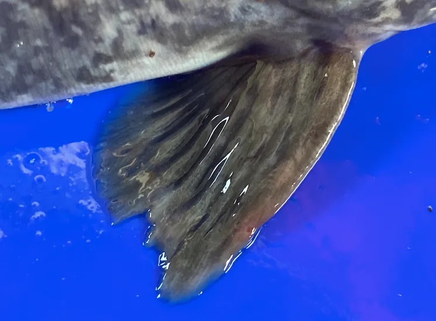

# <<課題について投稿する際に添えて欲しい内容>>

# 制作アプリのタイトル
・魚全長自動計測ツール

# 制作アプリの説明（40文字程度）
・画像を選んでアップロードした後、定規入力で魚の全長を即算出。

# 工夫した点・こだわった点
・Roboflow API に直接POSTするだけでMVPが完成し、フロントだけでもAIアプリが作れる手軽さを実感した。

・1cm＝px を手入力できるので、撮影距離が変わっても精度を保持できる

# 次回トライしたこと（または機能）
・縦向き魚にも対応したい

・検出位置と長さを視覚的に表示させたい

# 備考（感想、シェアしたいこと等なんでも）
この計測ツールが 危険で手間のかかるサンプリングをどう変えるのか？

定期的に重量と体長を計測することは、成長計測において重要であると言われている。

・課題1
暴れる魚を手で押さえながらメジャーを当てる必要がある。ストレスで魚体を傷付けやすく、スレの原因になる。

→魚をトレイに置き、定規を横に添えて写真を撮るだけでOK。Roboflow APIが、自動で全長を算出。

・課題２
ナマズのヒレには毒棘があり刺されるとめっちゃ痛い

→非接触で安全である

・課題3
長さを読む、手袋を取り手を乾いた布で拭く、ノートにメモする、エクセルに転記する間に誤差が出る

→ヒューマンエラーを排除できる

<参考写真>

